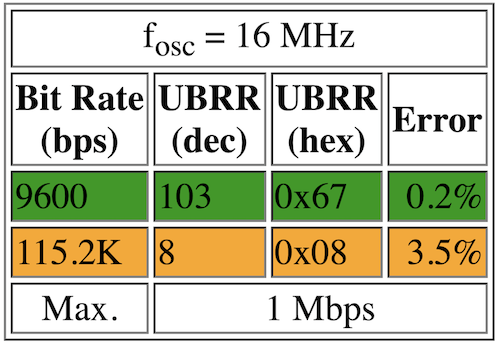

[](https://www.ardu-badge.com/DWIN%20Unified)
# DWIN Unified

**Feature‑rich, easy‑to‑use DWIN DGUS/T5L library** — portable C core, tiny RAM footprint, and practical high‑level APIs for real projects.

- ✅ High‑level API: pages, brightness, overlay/touch routing, fonts, graphs, RTC, NOR Flash
- ✅ Ultra‑low‑SRAM text I/O: streams from `F("…")` / PROGMEM in small chunks
- ✅ Robust RX parser & CRC: accepts CMD+PAYLOAD or full‑frame CRC; optional CRC16 on TX
- ✅ No dynamic allocation: predictable on AVR; SoftwareSerial‑friendly
- ✅ Portable: Arduino/ESP32 today; **STM32 HAL port** included under `ports/stm32/`

---

## Quick start

### 1) Load the HMI (panel) *(optional)*
This step is **not required** to use the library. The sample **DWIN_SET** image simply helps you *see* the provided examples on the screen and better understand the API. If you already have your own HMI project, you can skip this step.
Download the **DWIN_SET** image from Releases and update the panel:
- Latest: https://github.com/user-attachments/files/24968996/DWIN_SET_v1.0.0.zip
- Unzip → copy **`DWIN_SET/`** to the **root** of a FAT32 microSD (max16GB) → power ON the panel → wait for update → remove card.

### 2) Wire the UART
Pick one:
- **UNO/Nano** → SoftwareSerial: **TX→D9, RX→D8**, GND common
- **MEGA/boards with Serial1** → Panel TX→**RX1**, Panel RX→**TX1**, GND
- **ESP32** → Serial2: Panel TX→**GPIO16 (RX2)**, Panel RX→**GPIO17 (TX2)**, GND

#### Baud rate note (Arduino/AVR)


- On **ATmega328P @ 16 MHz**, the hardware UART has a small clocking error that depends on baud and U2X. Typical values: **9600 ≈ 0.2%**, **115200 ≈ 3.5%**. End‑to‑end error is the **sum** of both sides, so margins shrink fast at 115200.
- With **SoftwareSerial**, timing jitter makes it **significantly worse** (often ≥ 2× at 115200). Drops/framing/CRC errors are common.
- **Recommendation:** If you use Arduino (especially UNO/Nano or any SoftwareSerial setup), set **both the sketch and the DWIN panel to 9600 baud** for the most reliable operation. (STM32/ESP32 hardware UARTs usually run **115200** safely.)

### 3) Install & run
Install this library (Arduino Library Manager or PlatformIO), then open an example from **File → Examples → DWIN Unified** that matches your board. Each example demonstrates the API calls with concise comments.

Minimal sketch (HardwareSerial shown):
```cpp
#include <Arduino.h>
#include "dwin.h"

Dwin dwin;

// Glue your UART to the library
static size_t tx_write(const uint8_t* d, size_t n){ return Serial1.write(d, n); }
static int     rx_read(uint8_t* d, size_t){ if (Serial1.available()){ *d = Serial1.read(); return 1; } return 0; }
static int     rx_avail(){ return Serial1.available(); }
static uint32_t tick_ms(){ return millis(); }
static void     log_fn(const char* s){ Serial.println(s); }

// --- Minimal callbacks ---
// We keep callbacks tiny; any UI actions are handled in loop() via flags.
static volatile bool     g_touch_flag = false;   // set by on_touch(), handled in loop()
static volatile uint16_t g_last_vp     = 0;
static volatile uint8_t  g_last_ev     = 0;

// Touch: record VP and event; avoid heavy work here
static void on_touch(Dwin*, uint16_t vp, uint8_t ev) {
  g_last_vp = vp; g_last_ev = ev; g_touch_flag = true;
  Serial.print(F("[TOUCH] VP=0x")); Serial.print(vp, HEX);
  Serial.print(F(" EV=")); Serial.println(ev);
}
// Frame: optional debug (shows total length)
static void on_frame(Dwin*, const uint8_t*, size_t len) {
  Serial.print(F("[FRAME] len=")); Serial.println(len);
}

void setup(){
  pinMode(LED_BUILTIN, OUTPUT);
  Serial.begin(115200);        // USB log
  Serial1.begin(115200);         // DWIN UART (match your HMI)

  dwin_init(&dwin, tx_write, rx_read, rx_avail, tick_ms, log_fn);
  dwin_use_isr_queue(&dwin, 0); // set 1 if feeding bytes from ISR/serialEvent
  // dwin_use_crc(&dwin, 1);    // enable if your HMI expects TX CRC

  // Register callbacks (optional but useful)
  dwin_set_touch_callback(&dwin, on_touch);
  dwin_set_frame_callback(&dwin, on_frame);

  dwin_set_page(&dwin, 0);
  dwin_set_brightness(&dwin, 80);
  dwin_write_text(&dwin, 0x5000, F("Hello DWIN!"));
}

void loop(){
  dwin_poll(&dwin);            // keep the RX parser running

  // Minimal action example: on any touch → toggle LED and show a short message
  if (g_touch_flag) {
    g_touch_flag = false;                  // clear flag
    digitalWrite(LED_BUILTIN, !digitalRead(LED_BUILTIN));
    dwin_write_text(&dwin, 0x5000, F("Touched!")); // tiny, PROGMEM-safe
  }
}
```

---

## Examples (pick your board)

- **01_UNO_Nano_SoftwareSerial** — D8/D9, flush+listen glue, lowest SRAM
- **02_AVR_Serial1** — MEGA/Leonardo/Micro using `Serial1`
- **03_ESP32_Serial2** — ESP32 `Serial2` on GPIO16/17
- **04_Hardware_Serial_ISR** — Hardware UART + **ISR queue** (`serialEvent1()` feed)
- **05_demo_nano_project** — “demo examples” that shows most API calls

> Each example is stand‑alone (no `#ifdef`). Open, adjust pins/baud if needed, upload.

---

## Core features

- **Text that doesn’t kill SRAM**: `dwin_write_text()` streams from PROGMEM; `F("…")` works out of the box.
- **Safe font & style control**: `dwin_set_font_size()` preserves the font word; `dwin_set_color565()`, `dwin_set_visibility()`.
- **Precise positioning**: `dwin_sp_set_xy(sp, x, y)` writes `[X,Y]` as T5L expects.
- **UI toolbox**: `dwin_set_page()`, `dwin_get_page_now()`, `dwin_set_brightness()`, overlays & touch routing.
- **Time & storage**: display‑side RTC helpers and NOR Flash read/write.
- **Graphs**: simple plotting and clear helpers.

---

## Mini API cheatsheet

**Core**  
`dwin_init`, `dwin_poll`, `dwin_use_crc(0/1)`, `dwin_use_isr_queue(0/1)`, callbacks

**VP I/O**  
`dwin_write_vp`, `dwin_read_vp`, `dwin_write_u16`, `dwin_write_u32`, `dwin_write_float`, `dwin_write_text`, `dwin_clear_text`

**UI & Pages**  
`dwin_set_page`, `dwin_get_page_now`, `dwin_set_brightness`,  
`dwin_overlay_enable/disable`, `dwin_touch_disable_all/enable`,  
`dwin_set_visibility`, `dwin_set_color565`, `dwin_sp_set_xy`

**Time & Storage**  
`dwin_rtc_write`, `dwin_rtc_hw_set`, `dwin_nor_store`, `dwin_nor_load`

**Graphs**  
`dwin_graph_plot`, `dwin_graph_clear`

---

## Installation

**Arduino IDE**  
Search **DWIN Unified** in Library Manager (or copy this repo to `~/Documents/Arduino/libraries/DWIN_Unified`).

**PlatformIO**  
```ini
lib_deps = recepsenbas/DWIN Unified
```

---

## STM32 (HAL) port

For a step‑by‑step STM32 setup (IRQ enable, file placement, and CMake edits), see the **[STM32 HAL Quick Guide](ports/stm32/examples/README.md)**.


---

## Releases & HMI
- **DWIN_SET** images are shipped as **Release assets** (not in the repo).  
  Latest: https://github.com/user-attachments/files/23148351/DWIN_SET_v1.0.0.zip
- Match the sketch baudrate and CRC setting to your module side.

---

## License
MIT © Recep Senbas
